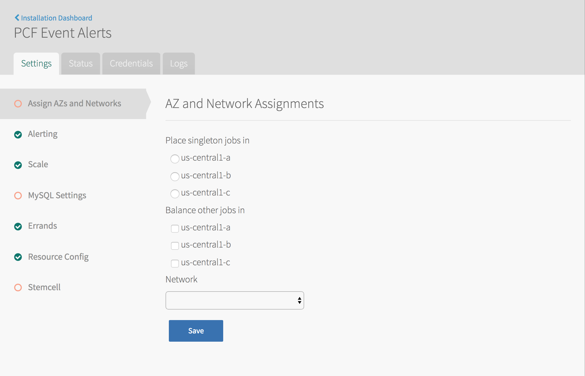
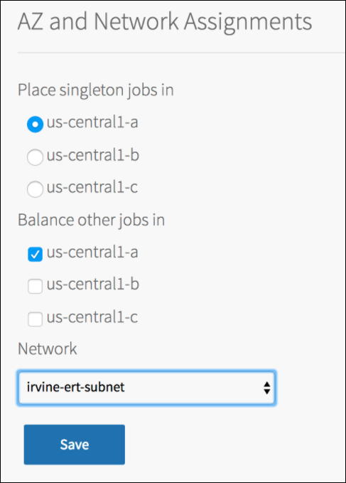
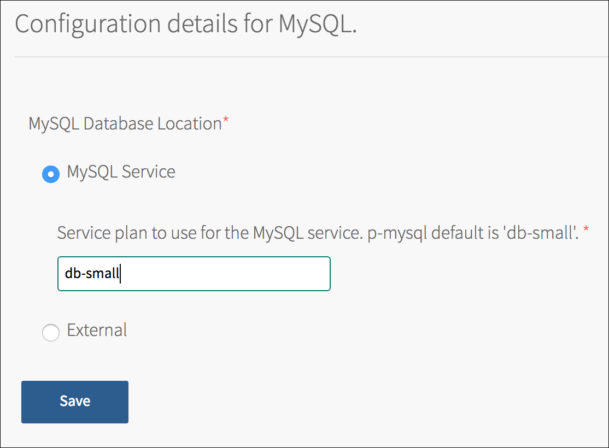
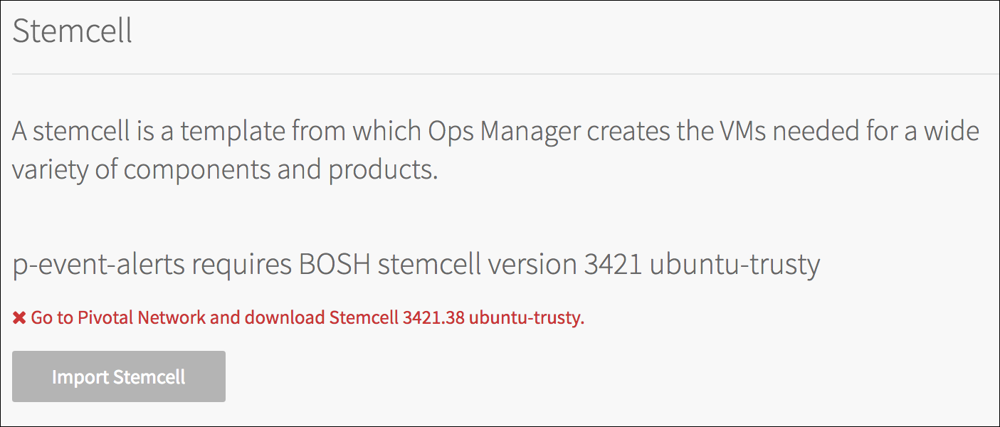

This topic describes how to install and configure PCF Event Alerts. For information on how to use this product, see [Using PCF Event Alerts](./using.html).

## Prerequisites

You must have the following in order to install PCF Event Alerts:

+ PAS v2.1.x deployed with the following:
  + `Email Notifications` enabled with SMTP server configured.
  + `Notifications Errand` and `Notifications UI Errand` run.
+ MySQL for PCF v2.0 or later, or external MySQL credentials
+ If you want notifications sent to Slack channels, a Slack account

## Download and Install the Tile

Follow the stops below to download and install the PCF Event Alerts tile:

1. Download the product file from [Pivotal Network](https://network.pivotal.io/).

1. Navigate to the Ops Manager Installation Dashboard and click **Import a Product** to upload the product file. 

1. Under the **Import a Product** button, click **+** next to the version number of PCF Event Alerts.
This adds the tile to your staging area.

1. Click the newly added **PCF Event Alerts** tile in orange to open its configuration panes.

    

##  Configure the Tile

Follow the stops below to configure the PCF Event Alerts tile.

###  Configure AZs and Networks

Follow the steps below to choose an Availability Zone (AZ) to run PCF Event Alerts and to select networks.

1. Click **Assign AZs and Networks**.
  

1. Configure the fields as follows:
  <table class="nice">
    <tr>
      <th>Field</th>
      <th>Description</th>
    </tr>
    <tr>
      <td><strong>Place singleton jobs in</strong></td>
      <td>Select the AZ for executing the PCF Event Alerts errands.
          PCF Event Alerts components execute as apps and do not require VMs.</td>
    </tr>
    <tr><td><strong>Balance other jobs in</strong></td>
        <td>Ignore this field.</td>
    </tr>
    <tr>
      <td><strong>Network</strong></td>
      <td>Select a subnet for the PCF Event Alerts errands.
          Use the subnet that includes the Pivotal Application Service (PAS) component VMs.
      
<strong>Note</strong>: The network selected is used only by errand VMs.

      </td>
    </tr>
  </table>
1. Click **Save**.

###  (Optional) Configure Scaling Settings

You can scale PCF event alerts by adding additional instances of the app.
Follow the steps below to optionally configure Scaling settings.

1. Click **Scaling Settings**.

1. Set the number of app instances. The default instance count for the `event-alerts` app is two. Environments with a very large number of 
alerts may need to scale to a larger number of instances. Environments that do not require a high availability
may scale down to one instance. 

1. Click **Save**. 

### Configure MySQL Settings

Follow the steps below to configure MySQL settings. 

PCF Event Alerts can either use the MySQL for PCF v2 service or an external database.

To use the MySQL for PCF v2 service, you must have installed MySQL for PCF v2.0 or later. 

#### Use the MySQL for PCF v2 Service

If you have MySQL for PCF v2.0 or later installed and want to use it for PCF Event Alerts,
follow the steps below.

1. Click **MySQL Settings**.

1. Select **MySQL Service** and enter the service plan to use. For example, `db-small`.
  

1. Click **Save**.

#### Use an External MySQL Database

If you want to use an external database for PCF Event Alerts, follow the steps below.

1. Click **MySQL Settings**.

1. Select **External**.

1. Configure the fields as follows:

    <table class="nice">
      <tr>
        <th>Field</th>
        <th>Description</th>
      </tr>
      <tr>
        <td><strong>MySQL Host</strong></td>
        <td>Enter the external MySQL database host address.</td>
      </tr>
      <tr>
        <td><strong>MySQL Port</strong></td>
        <td>Enter the external MySQL database port.</td>
      </tr>
      <tr>
        <td><strong>MySQL Username</strong></td>
        <td>
        Enter the external MySQL database username. 
        The user must have the following privileges for the PCF Event Alerts database:
        <code>ALTER</code>, <code>CREATE</code>, <code>DELETE</code>, <code>DROP</code>, <code>INDEX</code>, 
        <code>INSERT</code>, <code>LOCK TABLES</code>, <code>REFERENCES</code>, <code>SELECT</code>, and <code>UPDATE</code>.
        
<strong>WARNING</strong>: Do not delete the user that connects to the database.
           You can change the username, but the original user cannot be deleted. If the user is deleted, MySQL errors out.
         
 
      <tr>
        <td><strong>MySQL Password</strong></td>
        <td>Enter the external MySQL database password.</td>
      </tr>
      <tr>
        <td><strong>MySQL Database</strong></td>
        <td>Enter the external MySQL database name that PCF Event Alerts will use.</td>
      </tr>
    </table>

1. Click **Save**. 

### Verify Stemcell Version

1. Click **Stemcell**.

1. Verify the settings. If PCF Event Alerts cannot detect a stemcell TGZ file, the following message appears:
    
    If you need to upload a stemcell, perform the following steps:
      1. Navigate to [Pivotal Network](https://network.pivotal.io/) and click **Stemcells**.
      1. Download the appropriate stemcell version targeted for your IaaS.
      1. Return to the **Stemcell** section and click **Import Stemcell** to import the downloaded stemcell TGZ file.

1. Click **Save**.

1. Return to the Ops Manager Installation Dashboard and click **Apply Changes** to install the PCF Event Alerts tile.

## Install the PCF Event Alerts Plugin

You must install the PCF Event Alerts Plugin in order to configure notifications.
You can use this cf CLI plugin to subscribe to topics published by a variety of publishers, such as [PCF Healthwatch(http://docs.pivotal.io/pcf-healthwatch/1-2/index.html).

### Install the Plugin

The plugin is currently only available to admins.

To install the plugin, do the following:

1. Download the plugin binary from Pivotal Network.

1. Run the command `cf install-plugin PATH-TO-BINARY`.

### Uninstall the Plugin

To uninstall the plugin, run the command `cf uninstall-plugin event-alerts`.

