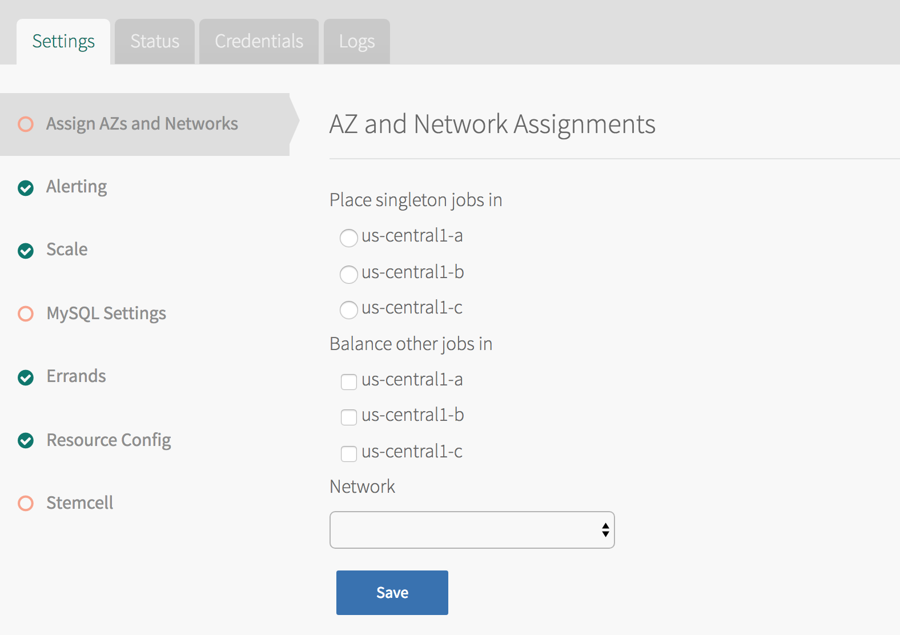

This topic describes how to install and configure PCF Event Alerts.

## Prerequisites

You must have the following in order to install PCF Event Alerts:

* A Pivotal Cloud Foundry (PCF) deployment v1.12 or later with Ops Manager installed
* [MySQL for Pivotal Cloud Foundry (PCF) v2.1](https://docs.pivotal.io/p-mysql/2-1/index.html) or later, or external MySQL credentials
* (Optional) Slack account for Slack integration

## Download and Install the Tile

Follow the stops below to download and install the PCF Event Alerts tile:

1. Download the product file from [Pivotal Network](https://network.pivotal.io/).

1. Navigate to the Ops Manager Installation Dashboard and click **Import a Product** to upload the product file. 

1. Under the **Import a Product** button, click **+** next to the version number of PCF Event Alerts.
This adds the tile to your staging area.

    

1. Click the newly added **PCF Event Alerts** tile in orange to open its configuration panes.

    

##  Configure the Tile

Follow the stops below to configure the PCF Event Alerts tile.

###  Configure AZs and Networks

Follow the steps below to choose an Availability Zone (AZ) to run PCF Event Alerts and to select networks.

1. Click **Assign AZs and Networks**.
  

1. Configure the fields as follows:
  <table class="nice">
    <tr>
      <th>Field</th>
      <th>Description</th>
    </tr>
    <tr>
      <td><strong>Place singleton jobs in</strong></td>
      <td>Select the AZ for executing the PCF Event Alerts errands. PCF Event Alerts components execute as apps and do not require VMs.</td>
    </tr>
    <tr><td><strong>Balance other jobs in</strong></td>
        <td>Ignore this field.</td>
    </tr>
    <tr>
      <td><strong>Network</strong></td>
      <td>Select a subnet for the PCF Event Alerts errands. Use the subnet that includes the Pivotal Application Service (PAS) (or Elastic Runtime) component VMs.
      
<strong>Note</strong>: The network selected is used only by errand VMs.

      </td>
    </tr>
  </table>
1. Click **Save**.

###  (Optional) Configure Alerting Settings

Follow the steps below to optionally configure Slack integration.

1. Click **Alerting**.

1. Navigate to the Slack Incoming WebHooks page at `YOUR-SLACK-DOMAIN/services/new/incoming-webhook`. For example, `https://my.slack.com/services/new/incoming-webhook/`. 
  

1. Click the **create a new channel** link.
  

1. Under **Name**, enter a name for the new channel where the alerts will appear.

1. Optionally add a **Purpose** for the channel and users to **Send invites to**.

1. Click **Create Channel**.

1. In the next page, optionally enter a **Descriptive Label** and choose the username that posts the integration under **Customize Name**.
  

1. Click **Save**. 

1. Scroll to the **Webhook URL** section.
  

1. Click **Copy URL**.

1. Return to the Alerting Settings section of PCF Event Alerts.
  

1. Under **Slack Webhook for All Events**, paste in the copied webhook URL.

1. Click **Save**. 

### Configure MySQL Settings

Follow the steps below to configure MySQL settings. 

PCF Event Alerts can either use the MySQL for PCF v2 service or an external database.

To use the MySQL for PCF v2 service, you must have installed MySQL for PCF v2.1 or later. For more information, see the MySQL for PCF v2.1 [documentation](https://docs.pivotal.io/p-mysql/2-1/).

#### Use the MySQL for PCF v2 Service

1. Click **MySQL Settings**.

1. Select **MySQL Service** and enter the service plan to use. For example, `db-small`.
  

1. Click **Save**.

#### Use an External MySQL Database

1. Click **MySQL Settings**.

1. Select **External**.

1. Configure the fields as follows:

    <table class="nice">
      <tr>
        <th>Field</th>
        <th>Description</th>
      </tr>
      <tr>
        <td><strong>MySQL Host</strong></td>
        <td>Enter the external MySQL database host address.</td>
      </tr>
      <tr>
        <td><strong>MySQL Port</strong></td>
        <td>Enter the external MySQL database port.</td>
      </tr>
      <tr>
        <td><strong>MySQL Username</strong></td>
        <td>
        Enter the external MySQL database username. 
        The user must have the following privileges for the PCF Event Alerts database:
        <code>ALTER</code>, <code>CREATE</code>, <code>DELETE</code>, <code>DROP</code>, <code>INDEX</code>, <code>INSERT</code>, <code>LOCK TABLES</code>, <code>REFERENCES</code>, <code>SELECT</code>, <code>UPDATE</code>.
        
<strong>WARNING</strong>: Do not delete the user that connects to the database. You can change the username, but the original user cannot be deleted. If the user is deleted, MySQL will error out.
         
 
      <tr>
        <td><strong>MySQL Password</strong></td>
        <td>Enter the external MySQL database password.</td>
      </tr>
      <tr>
        <td><strong>MySQL Database</strong></td>
        <td>Enter the external MySQL database name that PCF Event Alerts will use.</td>
      </tr>
    </table>

1. Click **Save**. 

### Verify Stemcell Version

1. Click **Stemcell**.

1. Verify the settings. If PCF Event Alerts cannot detect a stemcell `.tgz` file, the following message displays:
    
    If you need to upload a stemcell, perform the following steps:
      1. Navigate to [Pivotal Network](https://network.pivotal.io/) and click **Stemcells**.
      1. Download the appropriate stemcell version targeted for your IaaS.
      1. Return to the **Stemcell** section and click **Import Stemcell** to import the downloaded stemcell `.tgz` file.

1. Click **Save**.

1. Return to the Ops Manager Installation Dashboard and click **Apply Changes** to install the PCF Event Alerts tile.
